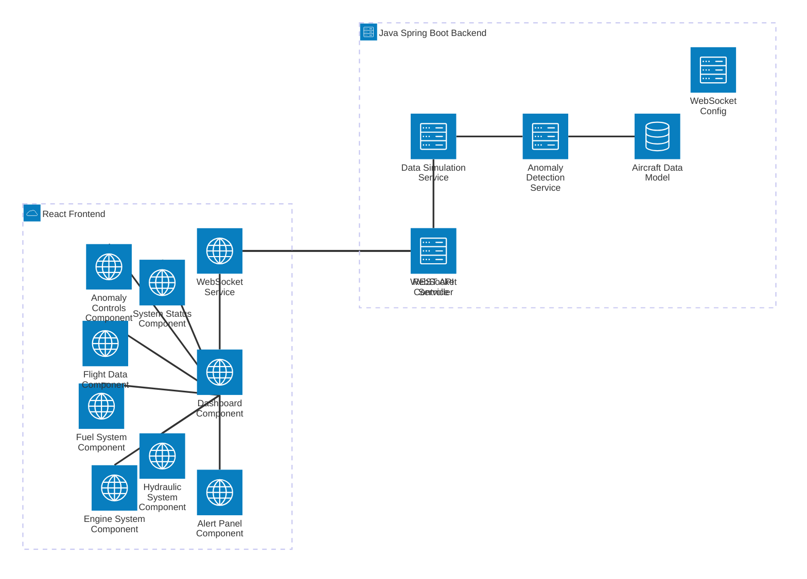

# Aircraft Health Monitoring System - Architecture Documentation

This document provides a high-level overview of the Aircraft Health Monitoring System architecture, including major components, services, and how they interact.

## System Overview

The Aircraft Health Monitoring System is a comprehensive full-stack application that simulates aircraft sensor data streaming for real-time monitoring and anomaly detection. The system consists of a Java Spring Boot backend and a React frontend, connected via WebSocket for real-time data communication.

## Architecture Diagram

## Key Components

### Backend Components (Java Spring Boot)

1. **AircraftMonitoringApplication**: Main Spring Boot application class that initializes the application.

2. **AircraftData Model**: Central data structure that represents aircraft sensor readings including:
   - Engine system (RPM, temperature, oil pressure, oil temperature)
   - Fuel system (level, consumption, pressure, temperature)
   - Hydraulic system (pressure, temperature, fluid level)
   - Flight data (altitude, airspeed, ground speed, Mach number)
   - Additional systems (cabin pressure, battery voltage, generator output)
   - Anomaly detection flags for each system

3. **Data Simulation Service**: Generates realistic aircraft sensor data:
   - Scheduled to run every 2 seconds
   - Creates correlated data (e.g., engine RPM affects temperature)
   - Supports anomaly simulation on demand
   - Maintains stateful simulation with gradual changes

4. **Anomaly Detection Service**: Analyzes sensor data to detect issues:
   - Configurable thresholds for each system
   - Detailed logging for anomalies
   - Threshold-based monitoring for:
     - Engine: RPM (500-3000), Temperature (>200°C), Oil Pressure (20-100 PSI)
     - Fuel: Level (<20%), Consumption (>1000 GPH), Pressure (10-50 PSI)
     - Hydraulic: Pressure (2000-3500 PSI), Temperature (>80°C), Fluid Level (<80%)
     - Flight data: Altitude (>45000 ft), Airspeed (>600 knots), Mach (>0.9)

5. **WebSocket Service**: Handles real-time communication:
   - Manages client connections and broadcasting
   - Sends aircraft data, alerts, and connection messages
   - Implements error handling and reconnection logic

6. **REST API Controller**: Provides endpoints for:
   - Retrieving current aircraft data
   - System status information
   - Triggering anomaly simulations
   - Health monitoring

7. **WebSocket Configuration**: Configures WebSocket communication:
   - Sets up WebSocket endpoints and handlers
   - Configures CORS for development
   - Enables SockJS fallback for older browsers

### Frontend Components (React + Tailwind CSS)

1. **WebSocket Service**: Client-side service that:
   - Connects to backend WebSocket
   - Handles real-time data updates
   - Manages connection status and reconnection
   - Provides event-based communication

2. **Dashboard Component**: Main layout that:
   - Orchestrates all system displays
   - Shows overall aircraft status
   - Handles data distribution to child components

3. **System-specific Components**:
   - **EngineSystem**: Displays engine RPM, temperature, and oil pressure
   - **FuelSystem**: Shows fuel level, consumption, and pressure
   - **HydraulicSystem**: Visualizes hydraulic pressure, temperature, and fluid level
   - **FlightData**: Presents altitude, airspeed, and related flight information
   - **SystemStatus**: Provides an overview of all systems' health

4. **Anomaly Controls**: Interactive controls for testing the system by:
   - Triggering engine anomalies
   - Triggering fuel system anomalies
   - Triggering hydraulic system anomalies

5. **AlertPanel**: Displays real-time alerts and notifications with:
   - Multiple severity levels (INFO, WARNING, CRITICAL)
   - Automatic dismissal
   - Animation effects

## Communication Flow

1. **Data Generation and Processing**:
   - `DataSimulationService` generates aircraft sensor data every 2 seconds
   - Generated data is passed to `AnomalyDetectionService` for analysis
   - `AnomalyDetectionService` flags any anomalies based on thresholds
   - Processed data is sent to connected clients via `WebSocketService`

2. **WebSocket Communication**:
   - Backend `WebSocketService` broadcasts data to all connected clients
   - Frontend `WebSocketService` receives and processes incoming messages
   - Message types include:
     - `aircraft_data`: Real-time sensor data
     - `alert`: System alerts and warnings
     - `connection`: Connection status updates

3. **REST API Interaction**:
   - Frontend can request data via REST endpoints as needed
   - REST API provides:
     - `/api/aircraft/data`: Current aircraft sensor data
     - `/api/aircraft/status`: System status information
     - `/api/aircraft/health`: System health details
   - Anomaly simulation can be triggered via:
     - `/api/aircraft/simulate/engine-anomaly`
     - `/api/aircraft/simulate/fuel-anomaly`
     - `/api/aircraft/simulate/hydraulic-anomaly`

4. **User Interface Updates**:
   - Dashboard component distributes data to child components
   - Each system component visualizes its specific data
   - Alert panel displays warnings based on anomaly flags
   - System status provides an overall health summary

## Monitoring and Diagnostics

- Health check endpoint: `GET /actuator/health`
- Metrics endpoint: `GET /actuator/metrics`
- Application info: `GET /actuator/info`
- Comprehensive logging throughout the application

## Technology Stack

- **Backend**: Java Spring Boot
- **Frontend**: React with Tailwind CSS
- **Real-time Communication**: WebSocket with SockJS fallback
- **Data Format**: JSON for structured aircraft sensor data

## Development and Extension

To add new aircraft systems for monitoring:
1. Update `AircraftData.java` model with new sensor fields
2. Add anomaly detection logic in `AnomalyDetectionService.java`
3. Create new React component in `frontend/src/components/`
4. Add the new component to the Dashboard layout
5. Update WebSocket message handling as needed

## Conclusion

The Aircraft Health Monitoring System demonstrates a modern, real-time application architecture with clean separation of concerns and effective use of WebSockets for live data streaming. The system's modular design allows for easy extension to monitor additional aircraft systems or modify anomaly detection logic as needed.
